

# 🎮 BibliGotchi

  A custom-made Tamagotchi with a heavenly touch. Made by a 17-year-old from Bosnia and Herzegovina, this project showcases my learning journey in the hardware ecosystem. I designed this using KiCad for the PCB, OnShape for the structural case, and the Arduino IDE for the firmware.

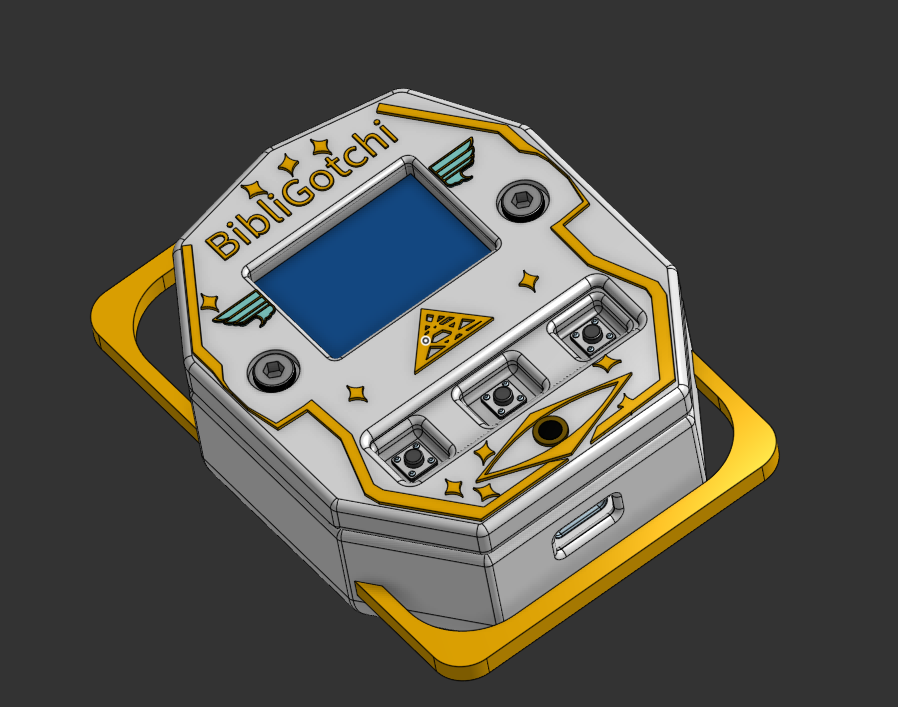

  This Tamagotchi features 3 main tracking stats: <strong>Hunger</strong>, <strong>Energy</strong>, and <strong>Happiness</strong>. You can improve these parameters by physically interacting with the device using tactile buttons—each mapped to mapped behaviors like playing, feeding, or sleeping. Depending on active stats, 4 distinct screen expressions dynamically cycle: neutral, happy, sad, or sleeping. All 32x32 pixel sprites are custom-drawn, giving you the template to easily drop in your own custom artwork!

## 💡 Why Did I Build This?

  I built this project to qualify for <strong>Fallout</strong>, a hardware hackathon organized by the non-profit community <strong>Hack Club</strong>. I gravitated toward building a Tamagotchi because it sits at the perfect crossroads: complex enough to challenge my design skills, yet interactive enough to stand out. In a world saturated with purely web-based apps, having a tangible, physical device makes it uniquely engaging. Through this process, I significantly deepened my understanding of firmware architecture and structural enclosure engineering.

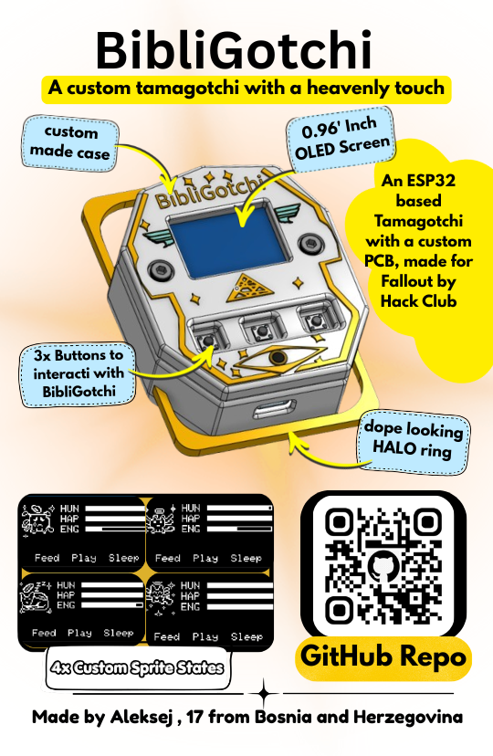

---

  <a href="Zine.pdf">📖 Read the Zine</a>
  &nbsp;&nbsp;•&nbsp;&nbsp;
  <a href="PCB-Files/Gerbers.zip">📦 Download Gerbers</a>
  &nbsp;&nbsp;•&nbsp;&nbsp;
  <a href="Case-Files/">📐 STEP Case Files</a>
  &nbsp;&nbsp;•&nbsp;&nbsp;
  <a href="BOM/BOM.csv">🧾 PCB BOM</a>

---

## 🔍 Overview
BibliGotchi is built around the **Seeed Studio XIAO ESP32-C3**, utilizing a custom PCB routed in KiCad to interface all peripherals smoothly. 

### Key Features:
* **Display**: 0.96" OLED screen for crisp UI rendering.
* **Power**: Integrated 3.7V 500mAh lithium-polymer battery.
* **Audio & Input**: Passive buzzer for alerts alongside 3 interactive navigation switches.
* **Enclosure**: Modeled inside OnShape ([View OnShape CAD Here](https://cad.onshape.com/documents/44d918d4bf107306610f1545/w/f7f086a823beff1369bb4e84/e/70df229ea8fe1c8cd39e3565)). Features filleted edge-geometry to completely eliminate sharp surfaces, precise cutouts for the USB-C port, and an internal structural sub-enclosure. The battery is safely clamped using a dual-screw retention bracket.
* **Firmware**: Written in C++ targeting the Arduino runtime environment. It implements real-time lifecycle status loops (tracking age, happiness levels, and depletion intervals) rendered via custom graphical progress bars.

---

## 📐 Case Gallery

| Top View | Top Side View |
| :---: | :---: |
| 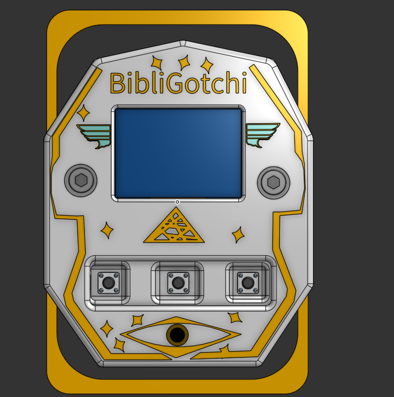 |  |
| **Bottom View** | **Exploded View** |
| 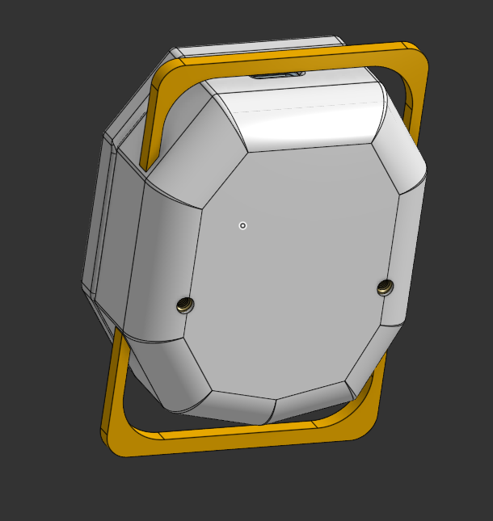 | 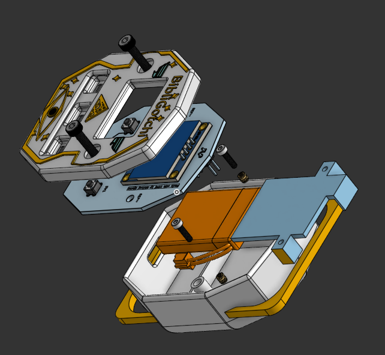 |

---

## ⚡ PCB Gallery

| Top View 1 | Top View 2 |
| :---: | :---: |
| 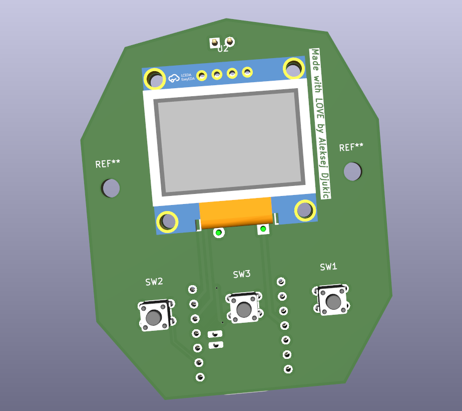 | 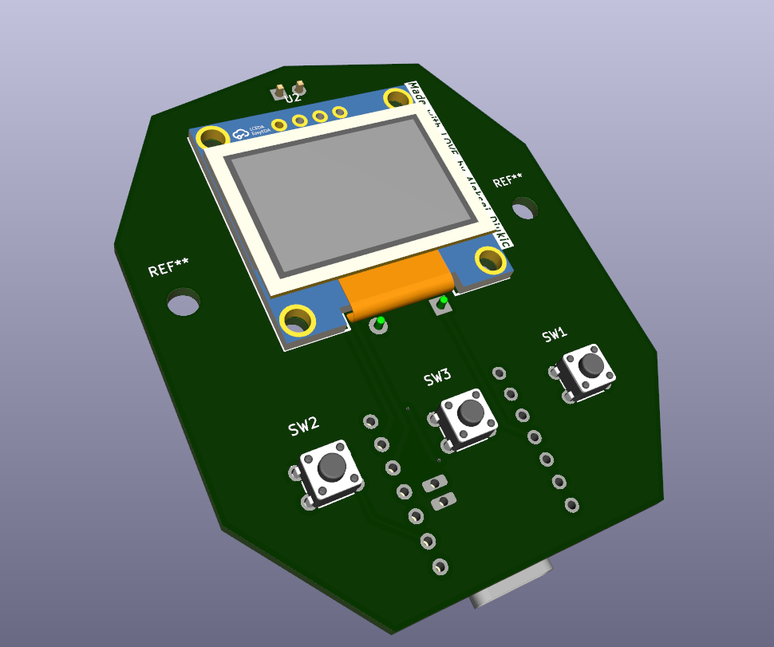 |
| **Bottom View 1** | **Bottom View 2** |
| 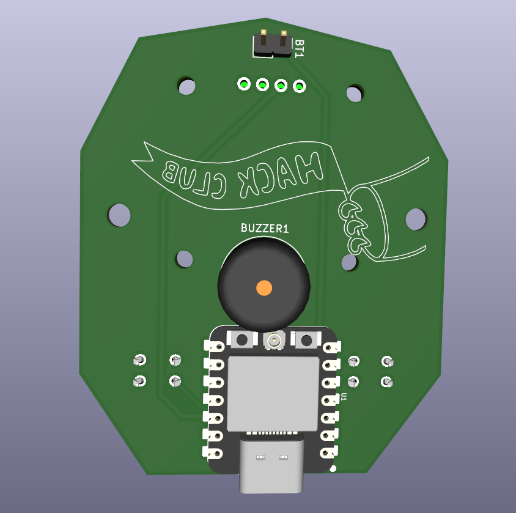 | 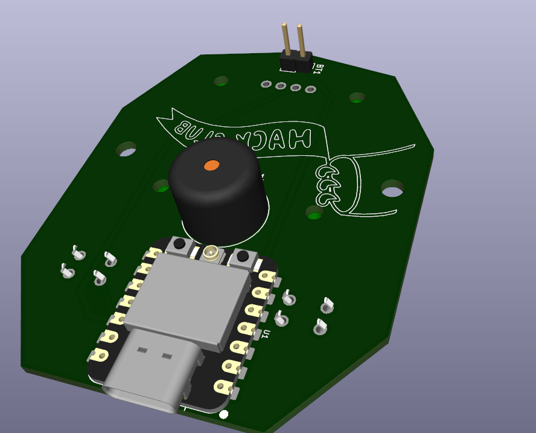 |

### Schematic

  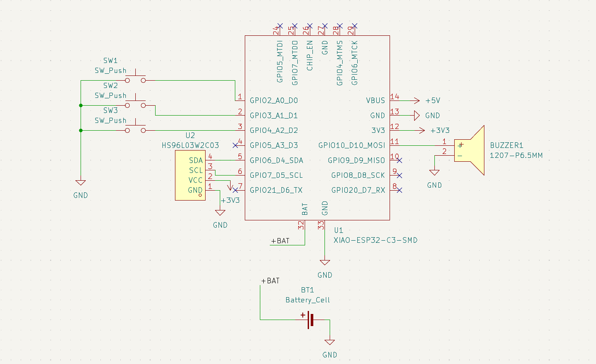

---

## 🗺️ Trace Routing

| Top Routing Layer | Bottom Routing Layer |
| :---: | :---: |
| 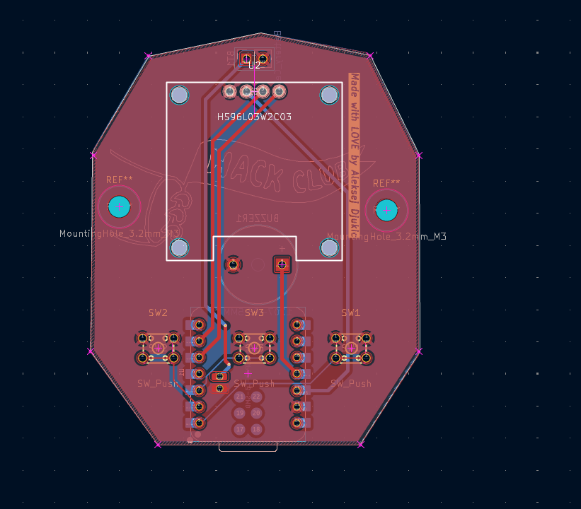 | 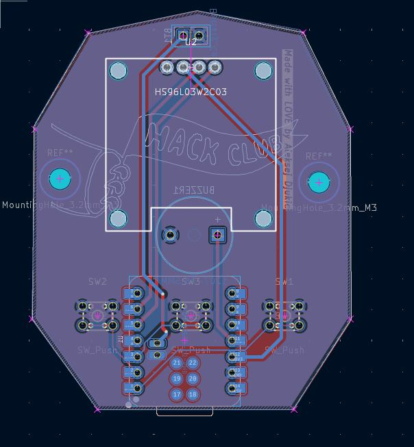 |

---

### 🛠️ Bill of Materials (BOM)

| Item | Description | Value | LCSC Part | Qty | MOQ | Unit Price | Total Price | Resources |
| :--- | :--- | :--- | :--- | :---: | :---: | :---: | :---: | :--- |
| Battery | Single-cell battery | Battery_Cell | | 1 | 1 | $5.11 | $5.11 | [Datasheet](https://www.kiwi-electronics.com/image/catalog/pdf/LP503035%20500mAh%203.7V%20%28AD306053%29%2020230615%5B34%5D.pdf), [Purchase Link](https://www.aliexpress.com/item/1005006043243361.html) |
| Buzzer | Passive Buzzer | 1207-P6.5MM | C49246964 | 1 | 10 | $0.03 | $0.32 | [Datasheet](https://www.lcsc.com/datasheet/C49246964.pdf), [Purchase Link](https://www.lcsc.com/product-detail/C49246964.html) |
| Switch | Push button switch, generic, two pins | SW_Push | C2888493 | 3 | 50 | $0.01 | $0.54 | [Datasheet](https://www.lcsc.com/datasheet/C2888493.pdf), [Purchase Link](https://www.lcsc.com/product-detail/C2888493.html) |
| ESP32-C3 MCU | IoT mini development board | XIAO-ESP32-C3-SMD | | 1 | 1 | $5.67 | $5.67 | [Datasheet](https://files.seeedstudio.com/wiki/XIAO_WiFi/Resources/esp32-c3_datasheet.pdf), [Purchase Link](https://www.aliexpress.com/item/1005006979844970.html) |
| OLED Display | 0.96" Inch OLED Display | HS96L03W2C03 | C5248080 | 1 | 1 | $2.24 | $2.24 | [Datasheet](https://www.lcsc.com/datasheet/C5248080.pdf), [Purchase Link](https://www.lcsc.com/product-detail/C5248080.html) |
| PCB | Hardware Fabrication Support | - | - | 1 | 5 | - | $4.00 | - |
| PCB Shipping | Shipping for the PCB, its kinda expensive cause I live outside the EU | - | - | - | - | - | $26.00 | - |
| **Total** | | | | **8** | **68** | **$13.10** | **$43.88** | |

### ⚙️ Structural Fasteners (Build BOM)

| Item | Description | Quantity | Total Price |
| :--- | :--- | :---: | :--- |
| M3 L20 Screws | Connects the structural Bottom and Top case layers while mounting the internal PCB safely | 2 | $0.10 (Bulk: ~$5.00) |
| M2 Screws L16mm | Threaded laterally into the side joints to guarantee optimal rigidity | 2 | $0.10 (Bulk: ~$5.00) |
| M2 Screws L8mm | Shorter structural screws allocated to tighten down the custom internal battery clamp | 2 | $0.10 (Bulk: ~$4.00) |
| M3 Heat Set Inserts | Threaded brass inserts allowing permanent, secure fastening profiles for outer casing | 2 | $0.10 (Bulk: ~$4.00) |
| M2 Heat Set Inserts | High-precision brass inserts matching structural point stabilization requirements | 4 | $0.20 (Bulk: ~$4.00) |
| **Total** | | **12** | **$0.60** (Actual Bulk Total: ~$22.00) |

---

## 🔧 Case Assembly Tutorial

### Step 1: Putting in the Battery
Seat the Battery into its enclosure in the Bottom Part, then put heat set inserts into the Battery Holder and place it onto the Battery Enclosure and screw it in.

| Align the Battery | Secure it with the Battery Holder |
| :---: | :---: |
| 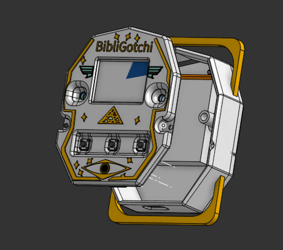 | 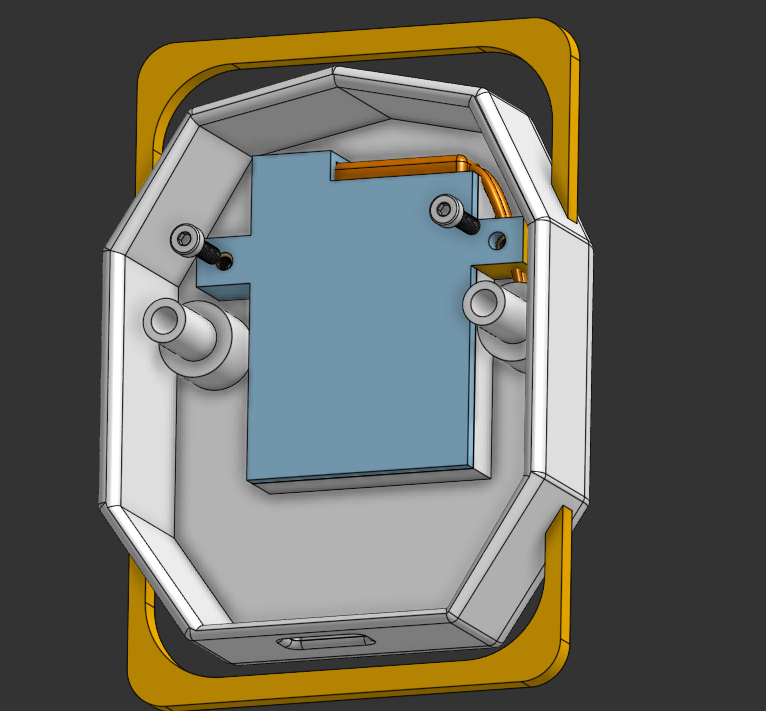 |

### Step 2: Assembling the PCB and the Top Cover to the Bottom Part
Press-fit the M3 brass heat-set inserts straight into the designated holes inside the lower structural wall. Bring the PCB to align its mounting holes with the supports from the Bottom Part, and then Align the Top Cover so that you can screw in the top cover and bottom cover through the hole nicely,  and drive the M3 L20 screws downward to securely clamp the whole sandwich layer together.

| Put in the M3 heat set inserts | Align the PCB | Put the Top Cover Nicely aligned on the PCB |
| :--: | :---: | :---: |
| 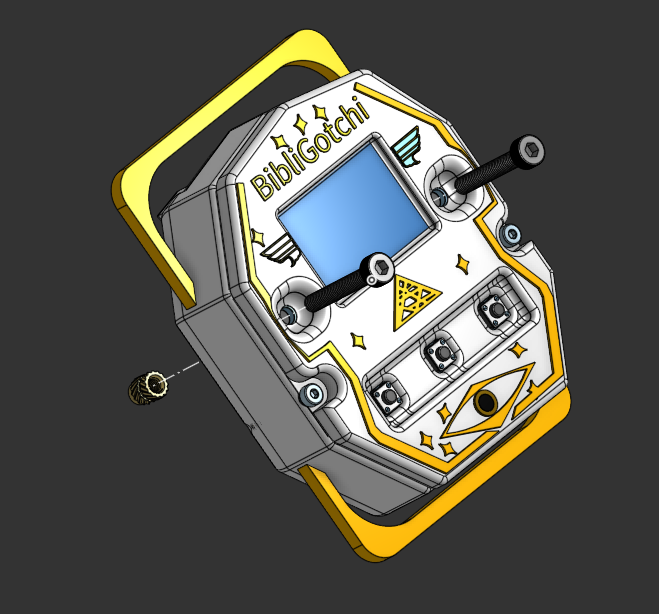 | 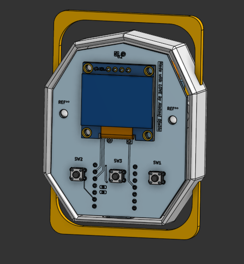 |  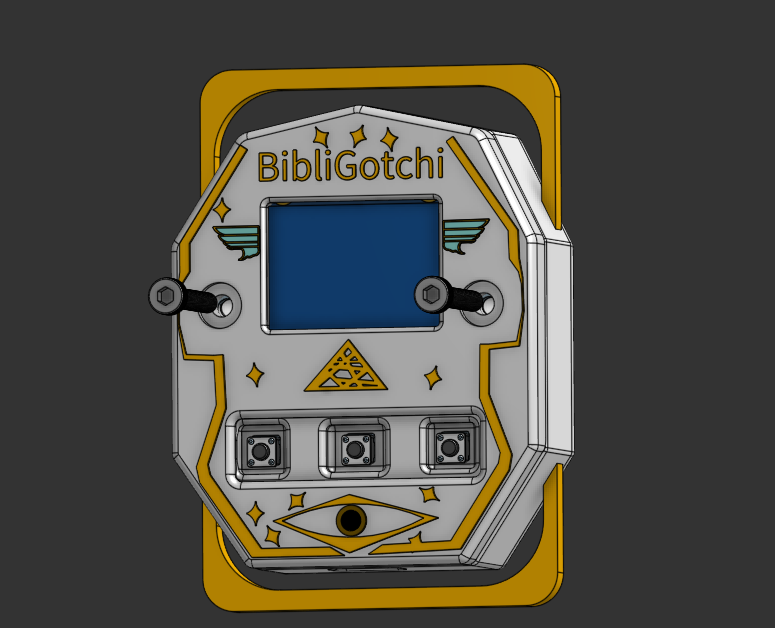 |

---

## 💻 Firmware Setup

The runtime firmware is engineered inside the Arduino core using C++. It executes cyclic ticks tracking core stat logic while parsing interactive structural button state triggers via hardware pull-up inputs:
* **Left Button (`Feed`)**: Replenishes missing core **HUN (Hunger)** values, keeping your pet fed.
* **Middle Button (`Play`)**: Trades **-5 ENG (Energy)** to buy **+10 HAP (Happiness)** metrics.
* **Right Button (`Sleep`)**: Switches state vectors directly into the deep sleeping routine, generating a custom visual screen profile and recharging **+15 ENG (Energy)** metrics.

### Expressive Character Matrix

| Sad State (`Any Stat < 30`) | Happy State (`All Stats > 50`) |
| :---: | :---: |
| 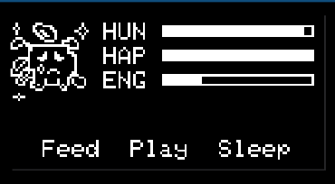 | 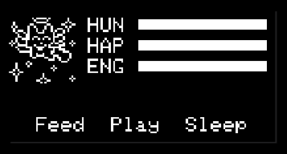 |
| **Neutral State (`Standard Default`)** | **Sleep State (`Sleep Trigger Engaged`)** |
| 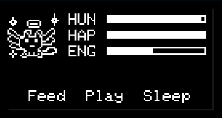 | 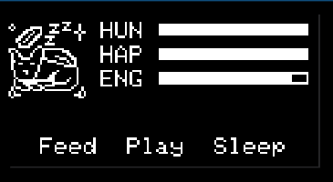 |

---

### 🚀 Compilation & Flashing Instructions

### Step 1: Install the ESP32 Board Package URL
Because ESP32 variants require platform abstraction extensions, add the official Espressif core indexes inside your environment parameters:
1. Open the **Arduino IDE**.
2. Navigate to **File** > **Preferences** (macOS: **Arduino IDE** > **Settings**).
3. Append the following address into the **Additional Boards Manager URLs** input row:
   `https://espressif.github.io/arduino-esp32/package_esp32_index.json`
   *(Note: Separate multiple indices using standard commas if you have existing entries).*
4. Click **OK** and allow indexing to finalize.

### Step 2: Fetch the Core Toolkit
1. Enter the Board Repository panel via **Tools** > **Board** > **Boards Manager**.
2. Run an evaluation sweep searching for `esp32`.
3. Locate **esp32 by Espressif Systems** and click **Install**. 
   *(Important: Verify package versions display `3.0.0` or newer to guarantee complete ESP32-C3 controller support).*

### Step 3: Instantiate local Sketch Files
Create a fresh runtime workspace profile inside the environment via **File** > **New Sketch**. Save this locally on your machine.

### Step 4: Bind Target Hardware Options
1. Go to **Tools** > **Board** > **esp32**.
2. Choose your precise module footprint: **XIAO ESP32C3**.
3. Select your system hardware serial mount path line entry under **Tools** > **Port**.

### Step 5: Resolve Peripheral Libraries
Enter the library workspace panel through **Sketch** > **Include Library** > **Manage Libraries** and search for and fetch the following dependencies:
1. **Adafruit SSD1306** (by Adafruit)
2. **Adafruit GFX Library** (by Adafruit—accept any cascading tracking dependencies if prompted)

### Step 6: Deploy Flash Assets
Link your BibliGotchi assembly to your development machine using a dependable data-rated USB-C cord. Copy the logic content found within your local `BibliGotchi_Firmware.ino` file directly over to your primary IDE sketch pane.
1. Click the **Verify** icon (the top-left checkmark layout symbol) to check for structural code errors.
2. Hit the **Upload** arrow icon situated immediately alongside it to build and flash the image over onto the controller.

### Step 7: Enjoy! 🎉
With both structural chassis parameters and software components fully synchronized, your interactive BibliGotchi buddy is officially up and running!

---

Built with ❤️ by Aleksej Djukic

**BibliGotchi • Fallout 2026**

