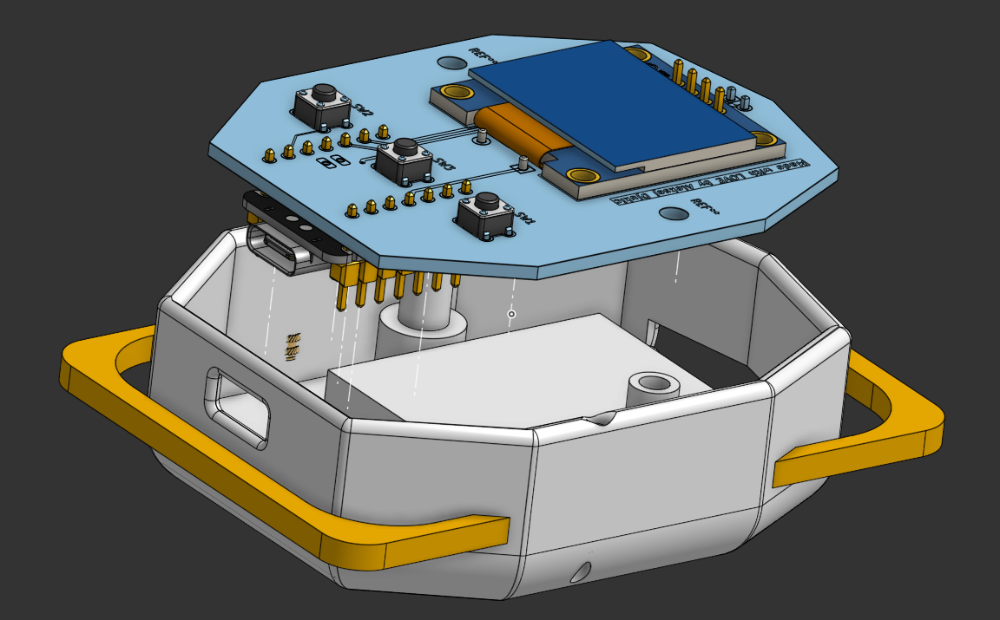
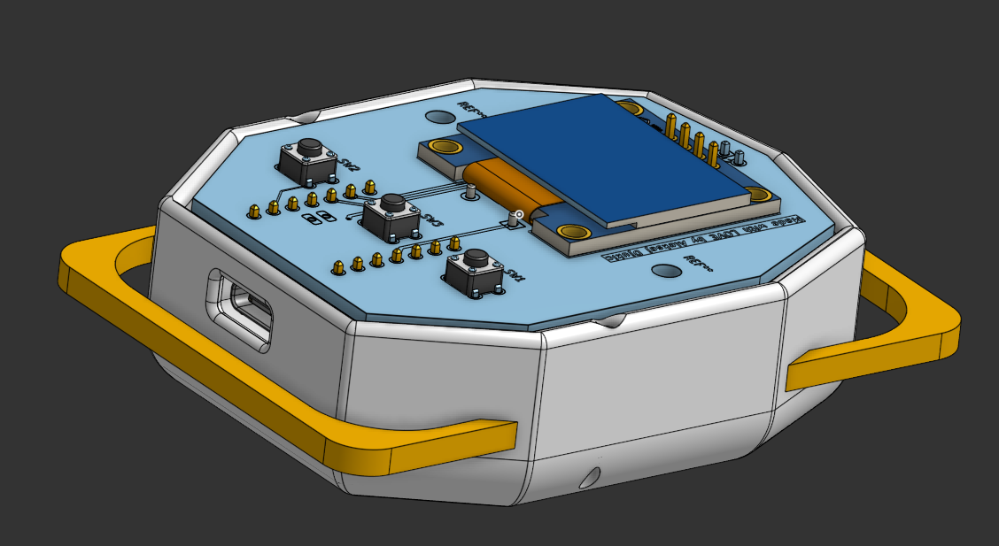
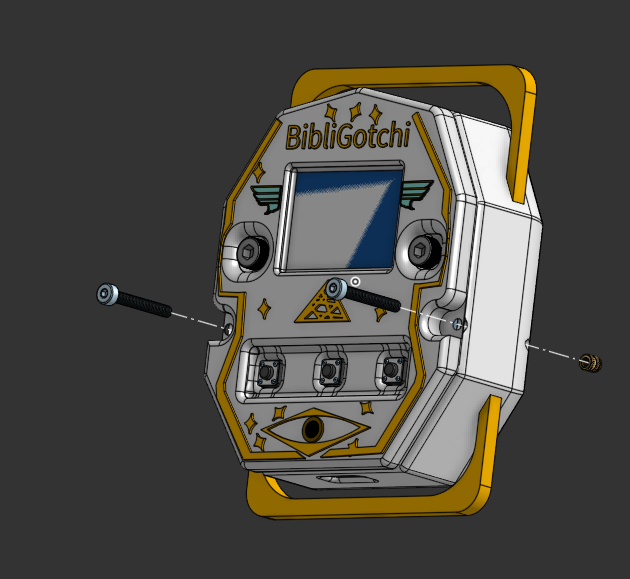
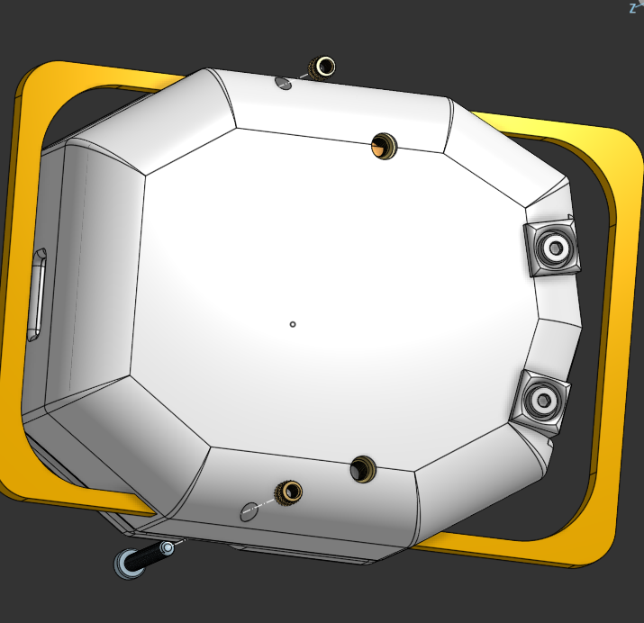
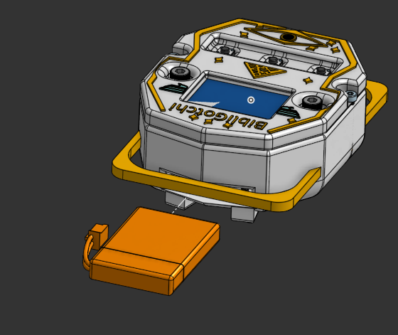
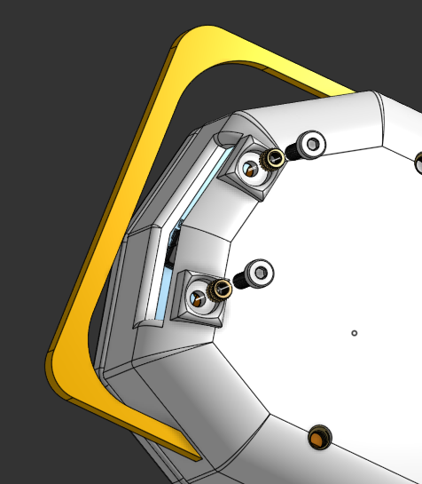
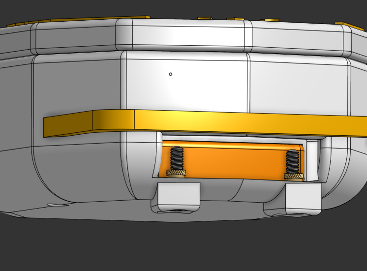

# BibliGotchi

  A custom made Tamagotchi, with a heavenly touch. Made by a 17 year old from Bosnia and Herzegovina, this project is a showcase of my learning in the hardware
  related space. I made this using KiCad for the PCB, OnShape for the case and Arduino IDE for the firmware.

  This tamagotchi features 3 main stats: Hunger, Energy and Happiness.
  You can improve these by interacting with the tamagotchi through the buttons, each button does something different , like play, feed or sleep.
  There is also 4 different screens depending on the stats: a screen with a neautral feeling, happy screen, sad screen and a sleeping screen.
  I drew my own 32x32 sprites, you can draw your own to customize this project even more.

<h1>
  Why did I make this project?
</h1>

  I made this project to qualify to a hackathon called Fallout , organized by a nonprofit organization called Hack Club. I chose to make this tamagotchi because 
  it really seemed like a not so simple , yet not super-advanced project , and at the same time it looked really cool and was interactive which is really importand nowadays
  in this world full of everything on the web, having something that you interact with physically makes it different and cooler, a project I really was hoping
  to build. It helped me better understand Firmware development, and also I improved my case design skills.

---

  <a href="Zine.pdf">Read the zine</a>
  &nbsp;|&nbsp;
  <a href="PCB-Files/Gerbers.zip">Download Gerbers</a>
  &nbsp;|&nbsp;
  <a href="Case-Files/">STEP case files</a>
  &nbsp;|&nbsp;
  <a href="BOM/BOM.csv">PCB BOM</a>

---

## Overview
BibliGotchi is a project built on the Seeed studio xiao-esp32-c6 , using a custom PCB designed in KiCad to make everything connected and work. BibliGotchi Features a 0.96' OLED Screen, a 3.7V 500mAH battery, a passive buzzer, 3x buttons for interactivity. I also built a custom case in OnShape, here is the <a href="https://cad.onshape.com/documents/44d918d4bf107306610f1545/w/f7f086a823beff1369bb4e84/e/70df229ea8fe1c8cd39e3565">OnShape Link </a>. The case features nicely made top and bottom cover, that I used filet on to eliminate sharp edges, I also added holes for the USB-C connection to the ESP32, the screen and inserting the battery. I also made a custom enclosure inside to keep the battery in, where u screw in 2 screws after putting in the battery and they keep it in. The firmware is developed in Arduino UNO using C++, it keeps the record of age, happines and other stats, and updates them as we interact with the BibliGotchi.It also displays the stats with progress bars.I also drew 4 sprites for the sleep,happy,sad,neutral states in a 32x32 pixel format.

## Case Galery

| Top View | Top Side View|
| --- | --- |
|  |  |
| Bottom View | Exploded View |
|  | |

## PCB Gallery

| Top View 1 | Top View 2 |
| --- | --- |
|  |  |
| Bottom View 1 | Bottom View 2 |
|  |  |

## Routing

| Top Routing | Bottom Routing |
| --- | --- |
|  |  |

## How to Assemble the Case Tutorial
# Step 1

  Just place the PCB on the bottom part , align the holes with the supports, just like this:

| Align the PCB | Place it on the bottom part |
| --- | --- |
|  |  |

# Step 2

  Put heat set inserts into the hole in the bottom for the M3 screw, then screw in the M3 screws to connect the bottom part, top part and secure the PCB:

| Align the Top Part | Screw it into the bottom part through the PCB |
| --- | --- |
|  |  |

# Step 3

  Put heat set inserts into the hole in the bottom for the M2 screw, then screw in the M2 screws:

| Put the M2 screws into the holes | Screw it in firmly |
| --- | --- |
|  |  |

# Step 4

 Put the battery into the battery holder I made in the case:

| Put the battery into the battery holder |
| --- |
|  |

# Step 5

  Put the heat set inserts here and then screw into them the little M2 L8mm screws, that will hold the battery in:

| Put the heat set M2 inserts in and screw in the L8mm M2 screws into them | Now they hold the battery firmly |
| --- | --- |
|  |  |

---

## Firmware 

  The firmware is made in Arduino IDE using C++, it tracks the age of the tamagotchi, and is listening for clicks of buttons to update the tamagotchi.
  

